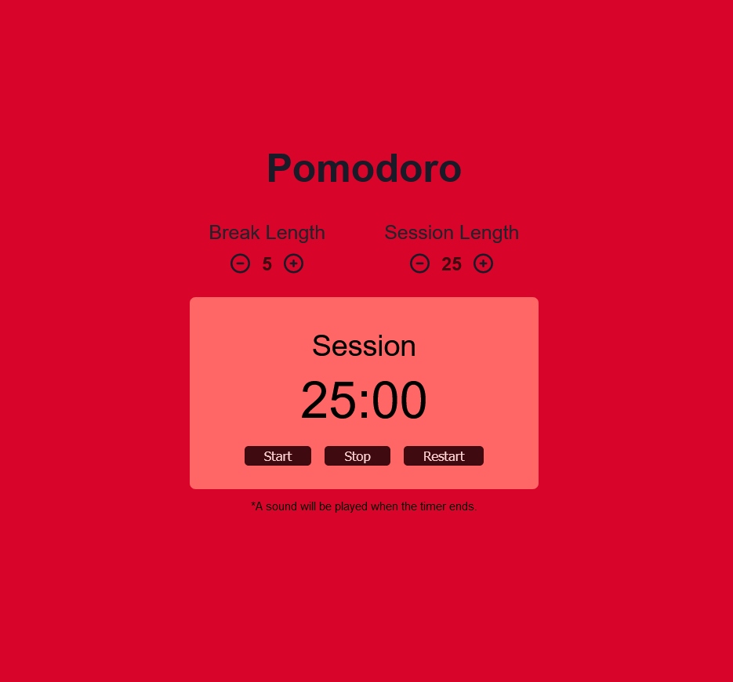

# freeCodeCamp - Front End Development Libraries Projects

This is a solution to the [Build a 25 + 5 Clock](https://www.freecodecamp.org/learn/front-end-development-libraries/front-end-development-libraries-projects/build-a-25--5-clock) /Pomodoro timer/ challenge by freeCodeCamp. 

## Table of contents

  - [The challenge](#the-challenge)
  - [Screenshot](#screenshot)
  - [Links](#links)
  - [Built with](#built-with)
  - [What I learned + My Process](#what-i-learned)
- [Author](#author)
- [Acknowledgments](#acknowledgments)

### The challenge

Build a 25 + 5 Clock.

You can use any mix of HTML, JavaScript, CSS, Bootstrap, SASS, React, Redux, and jQuery to complete this project. You should use a frontend framework (like React for example) because this section is about learning frontend frameworks.

User stories [here.](https://www.freecodecamp.org/learn/front-end-development-libraries/front-end-development-libraries-projects/build-a-25--5-clock)

### Screenshot

### Links

- Solution URL: [GitHub](https://github.com/ivelinsm/pomodoro)
- Live Site URL: [Netlify](https://keen-shannon-132c42.netlify.app/)

### Built with

- Semantic HTML5 markup
- Flexbox
- React

### What I learned + My Process

A learned quiet a few things here.

This was the first challenge that I tried to do following the steps in the official documents of React, more specifically [Thinking In React](https://reactjs.org/docs/thinking-in-react.html).

This concept cleared part of the chaos of how to use React in my head and managed to finish the challenge way faster than the other ones.

I started with a simple mock-up and breaking the UI into components.
Then I built a static version. The final and hardest part was to make it work and decide what to include in the state and what to pass as props.

Another tricky part was implementing SetInterval. I got into trouble with it because I forgot to clear it once I don't need it anymore.

After the problem with SetInterval that app was almost ready and needed only small changes as to work on the special cases like when the timer hits 00:00 or when decrementing the break/ session length below zero.

## Author

- Github - [ivelinsm](https://github.com/ivelinsm)
- freeCodeCamp - [@ivelinsm](https://www.freecodecamp.org/fcc927d30f9)

## Acknowledgments
